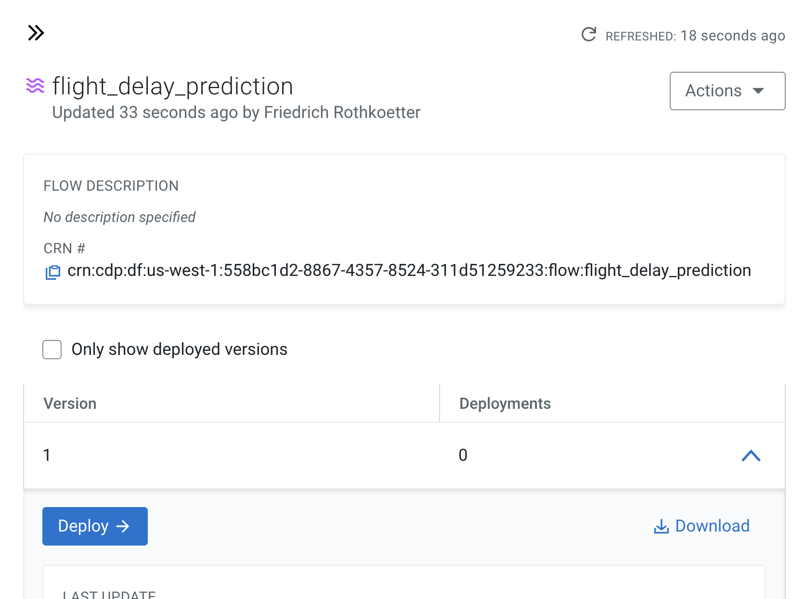
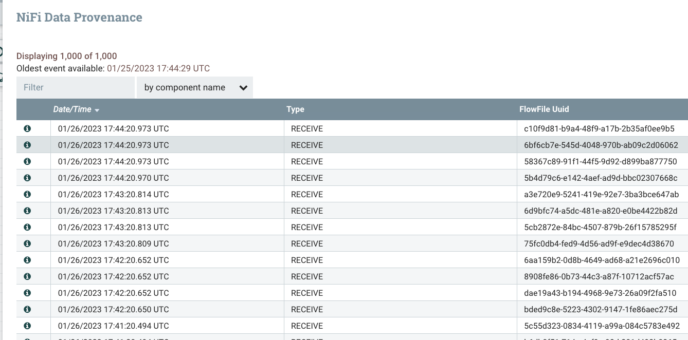

# Flight Delay Prediction

Part II of the Eyjafjallajökull project

## Description

This project show step by step how to setup the Flight Delay Prediction Demo


## Step  CML - Provision ModelAPI on Cloudera Machine Leraning

CML - provision AMPs Flight Cancellation

Create a project from the Flight Cancellation AMP


Run the deployment


Test the model API


## Step CDW - Provision Iceberg Table

Navigate to Cloudera Data Warehouse, then Virtual Warehouse and open the HUE SQL Authoring tool.

Create new database for your user to be used, or use one that is already created for you.

```sql
-- Change *** of database name
CREATE DATABASE airlinedata;
```
Make sure you in the right database!

Create the Iceberg table in the airlinedata Database
```sql
drop table if exists flights_streaming_ice;
create table flights_streaming_ice
( year string, month string, dayofmonth string,
 dayofweek string, deptime string,crsdeptime string, arrtime string,
 crsarrtime string, uniquecarrier string, flightnum string, tailnum string,
 actualelapsedtime string, crselapsedtime string, airtime string, arrdelay string,
  depdelay string, origin string, dest string, distance string, taxiin string,
 taxiout string, cancelled string,cancellationcode string, diverted string,
 carrierdelay string, weatherdelay string, nasdelay string, securitydelay string,
lateaircraftdelay string, origin_lon string,origin_lat string, dest_lon string,dest_lat string,
prediction string, proba string, weather_json string
 )
stored by
 ICEBERG;

 drop view flights_streaming_ice_cve;
 create view flights_streaming_ice_cve as
 select
   year, month, dayofmonth, dayofweek, deptime, crsdeptime, arrtime, crsarrtime, uniquecarrier, flightnum, tailnum,
   actualelapsedtime, crselapsedtime, airtime, arrdelay, depdelay, origin, dest, cast( distance as integer ) as distance, taxiin, taxiout,
   cancelled, cancellationcode, diverted, carrierdelay, weatherdelay, nasdelay, securitydelay, lateaircraftdelay,
   origin_lon, origin_lat, cast( dest_lon as float) as dest_lon, cast(dest_lat as float) as dest_lat,
   cast( translate( substr(prediction, instr(prediction,'prediction=')+11,1 ),'}','') as float) as prediction,
   cast( translate( substr(prediction, instr(prediction,'proba=')+6,4 ),'}','') as float) as proba,
   case translate( substr(prediction, instr(prediction,'prediction=')+11,1 ),'}','')
     when 1 then trunc(rand() * 99 + 1) end as prediction_delay ,
   cast( translate( substr( weather_json, instr(weather_json,'temp=')+5,5 ),',','') as float) as  temp,
   cast( translate( substr( weather_json, instr(weather_json,'pressure=')+9,6 ),',','') as float) as  presssure,
   cast( translate( substr( weather_json, instr(weather_json,'humidity=')+9,2 ),',','') as float) as  humidity,
   cast( translate( substr( weather_json, instr(weather_json,'speed=')+6,5 ),',','') as float) as  wind_speed,
   cast( translate( substr( weather_json, instr(weather_json,'all=')+4,3 ),'}','') as float) as clouds
 from
   flights_streaming_ice;


select
 *
from
 flights_streaming_ice_cve
limit 10;

```

## Step Create a account on OpenWeather and grep the key

Open in a browser OpenWeather
https://openweathermap.org/

Create a account and grep the Key


The free tier account is able for 60 API calls per minutes.


## Step CDF - Provision Nifi Flow

Import Flow into the CDF catalog

Upload nifi_flow_flight_prediction_with_ice.json and import


Deplay the DataFlow




Parameters


CDPEnvironment

```
/home/nifi/additional/secret/env_config/hive-site.xml,/home/nifi/additional/secret/env_config/core-site.xml,/home/nifi/additional/secret/env_config/ssl-client.xml
```

aws_access_key_id
aws_secret_access_key
lookup in AWS IAM

bucket
existing bucket in S3/AWS

Pick the cml_access_key  and cml_model_url from the above created CML ModelAPI

###cml_access_key
"mzhv0lqktleqhp9ys8axlrfz60iaw6fv"
Example, key in quotes

###cml_model_url
https://modelservice.ml-2de008cb-861.se-sandb.a465-9q4k.cloudera.site/model
(example)

###openweather_appid
aksldfjaslkfj-e96c82df4cb3c76e89480db9329ca897
Note: create a account on OpenWeather

###cdp_workload_user
CDP Workkoad User

###cdp_workload_password
CDP Password of Workload user

## Step CDV - Import Dashboard Visual
Download the flight_prediction_dataviz.json file from the githup on your laptop and follow the following steps


## Step start the flight events

Navigate on your laptop go to faker_flights directory

Pick the public CDF endpoint and port from the provision Nifi flow

```shell
./gen.sh cdf_endpoint_of_the_nifi_flow
```

Navigate to CDF provisioned Flow and you should see like the following


Click into the Flow and open Nifi


Click on the first processor Inhale events that it recives events



4-5 Events per minute


Navigate to DataViz and run the previously imported Dashboard


In Hue run the query

```SQL
select
 *
from
 flights_streaming_ice_cve
limit 10;
```
In the markup map asign lon/lat to see airport locations


##Streaming near-realtime Data Integration

Anaylsts need real-time or near real.time functionality to deliver continuesly data for real-time data analytics and applications.

In the following steps we apply transformations and optimize the data for consumption.

###Create a offset tabel
To recored the last timestamp of the data integrated we require a small table that contains just a single row with the timesamp.

```SQL
drop table if exists flights_streaming_offset;
create table flights_streaming_offset (t bigint);
```

Create destination table (empty)

```SQL
create table
   flights
as select
 *
from
 flights_prediction_ice_cve
where 1=2;
```

Next step is to initalize the temp table and apply transformations.

```SQL
drop table if exists flights_streaming__tmp;
create  table flights_streaming__tmp
as
with flights as(select
    year, month, dayofmonth, dayofweek, deptime, crsdeptime, arrtime, crsarrtime, uniquecarrier, flightnum, tailnum,
   actualelapsedtime, crselapsedtime, airtime, arrdelay, depdelay, origin, dest, cast( distance as integer ) as distance, taxiin, taxiout,
   cancelled, cancellationcode, diverted, carrierdelay, weatherdelay, nasdelay, securitydelay, lateaircraftdelay,
   origin_lon, origin_lat, cast( dest_lon as float) as dest_lon, cast(dest_lat as float) as dest_lat,
  cast( translate( substr(prediction, instr(prediction,'prediction=')+11,1 ),'}','') as float) as prediction,
   cast( translate( substr(prediction, instr(prediction,'proba=')+6,3 ),'}','') as float) as proba,
   case translate( substr(prediction, instr(prediction,'prediction=')+11,1 ),'}','')
     when 1 then trunc(rand() * 99 + 1) end as prediction_delay ,
   cast( translate( substr( weather_json, instr(weather_json,'temp=')+5,5 ),',','') as float) as  temp,
   cast( translate( substr( weather_json, instr(weather_json,'pressure=')+9,6 ),',','') as float) as  presssure,
   cast( translate( substr( weather_json, instr(weather_json,'humidity=')+9,2 ),',','') as float) as  humidity,
   cast( translate( substr( weather_json, instr(weather_json,'speed=')+6,5 ),',','') as float) as  wind_speed,
   cast( translate( substr( weather_json, instr(weather_json,'all=')+4,3 ),'}','') as float) as clouds
 from flights_streaming_ice
)
select
 *
from
 flights;
```

move the rows in the temporary table into the destination table.

```SQL
insert into table
  flights
select
`year`, `month`, `dayofmonth`, `dayofweek`, `deptime`, `crsdeptime`, `arrtime`, `crsarrtime`, `uniquecarrier`, `flightnum`, `tailnum`, `actualelapsedtime`, `crselapsedtime`, `airtime`, `arrdelay`, `depdelay`, `origin`, `dest`, `distance`, `taxiin`, `taxiout`, `cancelled`, `cancellationcode`, `diverted`, `carrierdelay`, `weatherdelay`, `nasdelay`, `securitydelay`, `lateaircraftdelay`, `origin_lon`, `origin_lat`, `dest_lon`, `dest_lat`, `prediction`, `proba`, `prediction_delay`, `temp`, `presssure`, `humidity`, `wind_speed`, `clouds`
from
 flights_streaming__tmp;
```

store the timestamp in the offset table:
```SQL
insert overwrite table
   flights_streaming_offset
select
  max( unix_timestamp(concat( year,'-', month, '-', dayofmonth, ' ' ,
       substring(lpad(deptime,4,'0'),1,2),':', substring(lpad(deptime,4,'0'),3,2) ,':00' )))
from
  flights_streaming__tmp;            
```    

cleanup the temp

```SQL
drop table if exists flights_streaming__tmp;
```

Wait 5 Minutes and rerun above statements here the offset table includes the max timestamp of the previous run

```SQL
drop table if exists flights_streaming__tmp;
create  table flights_streaming__tmp
as
with flights as(select
    year, month, dayofmonth, dayofweek, deptime, crsdeptime, arrtime, crsarrtime, uniquecarrier, flightnum, tailnum,
   actualelapsedtime, crselapsedtime, airtime, arrdelay, depdelay, origin, dest, cast( distance as integer ) as distance, taxiin, taxiout,
   cancelled, cancellationcode, diverted, carrierdelay, weatherdelay, nasdelay, securitydelay, lateaircraftdelay,
   origin_lon, origin_lat, cast( dest_lon as float) as dest_lon, cast(dest_lat as float) as dest_lat,
  cast( translate( substr(prediction, instr(prediction,'prediction=')+11,1 ),'}','') as float) as prediction,
   cast( translate( substr(prediction, instr(prediction,'proba=')+6,3 ),'}','') as float) as proba,
   case translate( substr(prediction, instr(prediction,'prediction=')+11,1 ),'}','')
     when 1 then trunc(rand() * 99 + 1) end as prediction_delay ,
   cast( translate( substr( weather_json, instr(weather_json,'temp=')+5,5 ),',','') as float) as  temp,
   cast( translate( substr( weather_json, instr(weather_json,'pressure=')+9,6 ),',','') as float) as  presssure,
   cast( translate( substr( weather_json, instr(weather_json,'humidity=')+9,2 ),',','') as float) as  humidity,
   cast( translate( substr( weather_json, instr(weather_json,'speed=')+6,5 ),',','') as float) as  wind_speed,
   cast( translate( substr( weather_json, instr(weather_json,'all=')+4,3 ),'}','') as float) as clouds
 from flights_streaming_ice
)
select
 *
from flights
where unix_timestamp(concat( year,'-', month, '-', dayofmonth, ' ' ,
      substring(lpad(deptime,4,'0'),1,2),':', substring(lpad(deptime,4,'0'),3,2) ,':00' )) >
       ( select max(t)
          from
           flights_streaming_offset
         )
;
```

```SQL
insert into table
  flights
select
`year`, `month`, `dayofmonth`, `dayofweek`, `deptime`, `crsdeptime`, `arrtime`, `crsarrtime`, `uniquecarrier`, `flightnum`, `tailnum`, `actualelapsedtime`, `crselapsedtime`, `airtime`, `arrdelay`, `depdelay`, `origin`, `dest`, `distance`, `taxiin`, `taxiout`, `cancelled`, `cancellationcode`, `diverted`, `carrierdelay`, `weatherdelay`, `nasdelay`, `securitydelay`, `lateaircraftdelay`, `origin_lon`, `origin_lat`, `dest_lon`, `dest_lat`, `prediction`, `proba`, `prediction_delay`, `temp`, `presssure`, `humidity`, `wind_speed`, `clouds`
from
 flights_streaming__tmp;
```

store the timestamp in the offset table:

```SQL
insert overwrite table
   flights_streaming_offset
select
  max( unix_timestamp(concat( year,'-', month, '-', dayofmonth, ' ' ,
       substring(lpad(deptime,4,'0'),1,2),':', substring(lpad(deptime,4,'0'),3,2) ,':00' )))
from
  flights_streaming__tmp;            
```    
