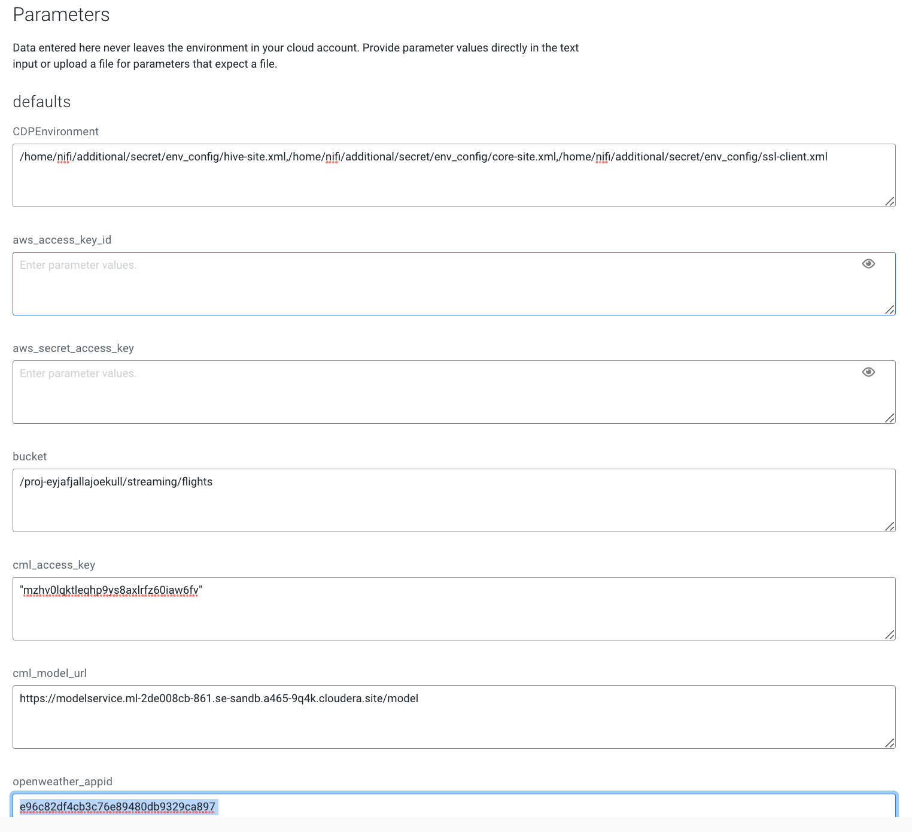
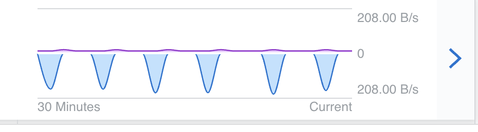

# Flight Delay Prediction

Part II of the Eyjafjallajökull project

## Description

This project show step by step how to setup the Flight Delay Prediction Demo


## Step  CML - Provision ModelAPI on Cloudera Machine Leraning

CML - provision AMPs Flight Cancellation

Create a project from the Flight Cancellation AMP


Run the deployment


Test the model API


## Step CDW - Provision Iceberg Table

Navigate to Cloudera Data Warehouse, then Virtual Warehouse and open the HUE SQL Authoring tool.

Create new database for your user to be used, or use one that is already created for you.

```sql
-- Change *** of database name
CREATE DATABASE airlinedata;
```
Make sure you in the right database!

Create the Iceberg table in the airlinedata Database
```sql
drop table if exists flights_prediction_ice;
create table flights_prediction_ice
( month int, dayofmonth int,
 dayofweek int, deptime int, crsdeptime int, arrtime int,
 crsarrtime int, uniquecarrier string, flightnum int, tailnum string,
 actualelapsedtime int, crselapsedtime int, airtime int, arrdelay int,
 depdelay int, origin string, dest string, distance int, taxiin int,
 taxiout int, cancelled int, cancellationcode string, diverted string,
 carrierdelay int, weatherdelay int, nasdelay int, securitydelay int,
lateaircraftdelay int, origin_lon float, origin_lat float, dest_lon float, dest_lat float,
prediction float, proba float, prediction_delay int,
temp float, pressure float, humidity integer, wind_speed float, clouds integer)
partitioned by (year int)
stored by
 ICEBERG;
```

## Step Create a account on OpenWeather and grep the key

Open in a browser OpenWeather
https://openweathermap.org/

Create a account and grep the Key


The free tier account is able for 60 API calls per minutes.


## Step CDF - Provision Nifi Flow

Import Flow into the CDF catalog

Upload nifi_flow_flight_prediction_with_ice.json and import


Deplay the DataFlow


Parameters



CDPEnvironment

```
/home/nifi/additional/secret/env_config/hive-site.xml,/home/nifi/additional/secret/env_config/core-site.xml,/home/nifi/additional/secret/env_config/ssl-client.xml
```

aws_access_key_id
aws_secret_access_key
lookup in AWS IAM

bucket
existing bucket in S3/AWS

Pick the cml_access_key  and cml_model_url from the above created CML ModelAPI

###cml_access_key
"mzhv0lqktleqhp9ys8axlrfz60iaw6fv"
Example, key in quotes

###cml_model_url
https://modelservice.ml-2de008cb-861.se-sandb.a465-9q4k.cloudera.site/model
(example)

###openweather_appid
aksldfjaslkfj-e96c82df4cb3c76e89480db9329ca897
Note: create a account on OpenWeather


## Step CDV - Import Dashboard Visual
Download the flight_prediction_dataviz.json file from the githup on your laptop and follow the following steps


## Step start the flight events

Navigate on your laptop go to faker_flights directory

Pick the public CDF endpoint and port from the provision Nifi flow

```shell
./gen.sh cdf_endpoint_of_the_nifi_flow
```

Navigate to CDF provisioned Flow and you should see like the following



Click into the Flow and open Nifi


Click on the first processor Inhale events that it recives events


4-5 Events per minute


Navigate to DataViz and run the previously imported Dashboard


